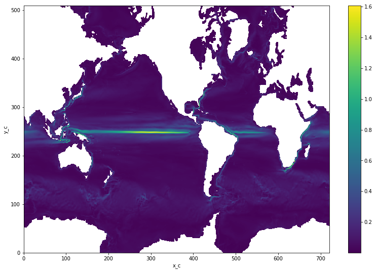
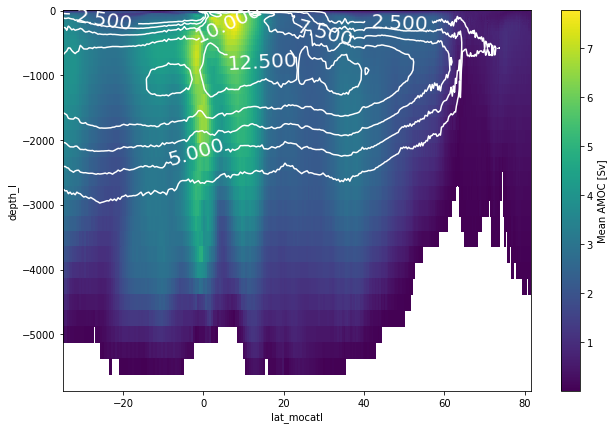

# Calculate the barotropic stream function on the ORCA grid

## Preamble: Import modules, turn off warnings, etc.


```python
import warnings
warnings.filterwarnings("ignore")
```


```python
%matplotlib inline
from dask.distributed import Client, wait
from pathlib import Path
import matplotlib.pyplot as plt
import xarray as xr
```


```python
try:
    client = Client(scheduler_file="../scheduler.json")
    client.restart()
    display(client)
except Exception as e:
    print("No scheduler.  Will continue in single-process mode.")
```


<table style="border: 2px solid white;">
<tr>
<td style="vertical-align: top; border: 0px solid white">
<h3>Client</h3>
<ul>
  <li><b>Scheduler: </b>tcp://127.0.0.1:8786
  <li><b>Dashboard: </b><a href='http://127.0.0.1:8787' target='_blank'>http://127.0.0.1:8787</a>
</ul>
</td>
<td style="vertical-align: top; border: 0px solid white">
<h3>Cluster</h3>
<ul>
  <li><b>Workers: </b>2</li>
  <li><b>Cores: </b>4</li>
  <li><b>Memory: </b>21.06 GB</li>
</ul>
</td>
</tr>
</table>


## Load the whole model run including the mesh file into a single grid-aware data set


```python
data_path = Path("../example-data/ORCA05.L46-KKG36F25H/")
```


```python
data_files = (
    sorted(data_path.glob("ORCA05.L46-KKG36F25H_1m_*_grid_?.nc")) +
    [data_path / "mesh_mask.nc", data_path / "new_maskglo.nc"]
)
```


```python
list(map(print, data_files));
```

    ../example-data/ORCA05.L46-KKG36F25H/ORCA05.L46-KKG36F25H_1m_20080101_20081231_grid_T.nc
    ../example-data/ORCA05.L46-KKG36F25H/ORCA05.L46-KKG36F25H_1m_20080101_20081231_grid_U.nc
    ../example-data/ORCA05.L46-KKG36F25H/ORCA05.L46-KKG36F25H_1m_20080101_20081231_grid_V.nc
    ../example-data/ORCA05.L46-KKG36F25H/ORCA05.L46-KKG36F25H_1m_20090101_20091231_grid_T.nc
    ../example-data/ORCA05.L46-KKG36F25H/ORCA05.L46-KKG36F25H_1m_20090101_20091231_grid_U.nc
    ../example-data/ORCA05.L46-KKG36F25H/ORCA05.L46-KKG36F25H_1m_20090101_20091231_grid_V.nc
    ../example-data/ORCA05.L46-KKG36F25H/mesh_mask.nc
    ../example-data/ORCA05.L46-KKG36F25H/new_maskglo.nc


```python
from xorca.lib import preprocess_orca

ds = xr.open_mfdataset(data_files,
                       preprocess=(lambda ds:
                                   preprocess_orca(data_path / "mesh_mask.nc", ds)))
ds = ds.chunk({"t": 1, "z_c": 23, "z_l": 23})
ds = ds.persist()
ds
```


    <xarray.Dataset>
    Dimensions:   (t: 24, x_c: 720, x_r: 720, y_c: 509, y_r: 509, z_c: 46, z_l: 46)
    Coordinates:
      * z_c       (z_c) int64 1 2 3 4 5 6 7 8 9 10 11 12 13 14 15 16 17 18 19 20 ...
      * z_l       (z_l) float64 0.5 1.5 2.5 3.5 4.5 5.5 6.5 7.5 8.5 9.5 10.5 ...
      * y_c       (y_c) int64 1 2 3 4 5 6 7 8 9 10 11 12 13 14 15 16 17 18 19 20 ...
      * y_r       (y_r) float64 1.5 2.5 3.5 4.5 5.5 6.5 7.5 8.5 9.5 10.5 11.5 ...
      * x_c       (x_c) int64 1 2 3 4 5 6 7 8 9 10 11 12 13 14 15 16 17 18 19 20 ...
      * x_r       (x_r) float64 1.5 2.5 3.5 4.5 5.5 6.5 7.5 8.5 9.5 10.5 11.5 ...
        depth_c   (z_c) float64 dask.array<shape=(46,), chunksize=(23,)>
        depth_l   (z_l) float64 dask.array<shape=(46,), chunksize=(23,)>
        llat_cc   (y_c, x_c) float32 dask.array<shape=(509, 720), chunksize=(509, 720)>
        llat_cr   (y_c, x_r) float32 dask.array<shape=(509, 720), chunksize=(509, 720)>
        llat_rc   (y_r, x_c) float32 dask.array<shape=(509, 720), chunksize=(509, 720)>
        llat_rr   (y_r, x_r) float32 dask.array<shape=(509, 720), chunksize=(509, 720)>
        llon_cc   (y_c, x_c) float32 dask.array<shape=(509, 720), chunksize=(509, 720)>
        llon_cr   (y_c, x_r) float32 dask.array<shape=(509, 720), chunksize=(509, 720)>
        llon_rc   (y_r, x_c) float32 dask.array<shape=(509, 720), chunksize=(509, 720)>
        llon_rr   (y_r, x_r) float32 dask.array<shape=(509, 720), chunksize=(509, 720)>
      * t         (t) datetime64[ns] 2008-01-16T12:00:00 2008-02-15 ...
    Data variables:
        sobowlin  (t, y_c, x_c) float32 dask.array<shape=(24, 509, 720), chunksize=(1, 509, 720)>
        sohefldo  (t, y_c, x_c) float32 dask.array<shape=(24, 509, 720), chunksize=(1, 509, 720)>
        sohefldp  (t, y_c, x_c) float32 dask.array<shape=(24, 509, 720), chunksize=(1, 509, 720)>
        somixhgt  (t, y_c, x_c) float32 dask.array<shape=(24, 509, 720), chunksize=(1, 509, 720)>
        somxl010  (t, y_c, x_c) float32 dask.array<shape=(24, 509, 720), chunksize=(1, 509, 720)>
        sosaline  (t, y_c, x_c) float32 dask.array<shape=(24, 509, 720), chunksize=(1, 509, 720)>
        soshfldo  (t, y_c, x_c) float32 dask.array<shape=(24, 509, 720), chunksize=(1, 509, 720)>
        sossheig  (t, y_c, x_c) float32 dask.array<shape=(24, 509, 720), chunksize=(1, 509, 720)>
        sosstsst  (t, y_c, x_c) float32 dask.array<shape=(24, 509, 720), chunksize=(1, 509, 720)>
        sowafldp  (t, y_c, x_c) float32 dask.array<shape=(24, 509, 720), chunksize=(1, 509, 720)>
        sowaflup  (t, y_c, x_c) float32 dask.array<shape=(24, 509, 720), chunksize=(1, 509, 720)>
        sowindsp  (t, y_c, x_c) float32 dask.array<shape=(24, 509, 720), chunksize=(1, 509, 720)>
        vosaline  (t, z_c, y_c, x_c) float32 dask.array<shape=(24, 46, 509, 720), chunksize=(1, 23, 509, 720)>
        votemper  (t, z_c, y_c, x_c) float32 dask.array<shape=(24, 46, 509, 720), chunksize=(1, 23, 509, 720)>
        sozotaux  (t, y_c, x_r) float32 dask.array<shape=(24, 509, 720), chunksize=(1, 509, 720)>
        vozocrtx  (t, z_c, y_c, x_r) float32 dask.array<shape=(24, 46, 509, 720), chunksize=(1, 23, 509, 720)>
        vozoeivu  (t, z_c, y_c, x_r) float32 dask.array<shape=(24, 46, 509, 720), chunksize=(1, 23, 509, 720)>
        sometauy  (t, y_r, x_c) float32 dask.array<shape=(24, 509, 720), chunksize=(1, 509, 720)>
        vomecrty  (t, z_c, y_r, x_c) float32 dask.array<shape=(24, 46, 509, 720), chunksize=(1, 23, 509, 720)>
        vomeeivv  (t, z_c, y_r, x_c) float32 dask.array<shape=(24, 46, 509, 720), chunksize=(1, 23, 509, 720)>
        e1t       (y_c, x_c) float64 dask.array<shape=(509, 720), chunksize=(509, 720)>
        e2t       (y_c, x_c) float64 dask.array<shape=(509, 720), chunksize=(509, 720)>
        e3t       (z_c, y_c, x_c) float64 dask.array<shape=(46, 509, 720), chunksize=(23, 509, 720)>
        e1u       (y_c, x_r) float64 dask.array<shape=(509, 720), chunksize=(509, 720)>
        e2u       (y_c, x_r) float64 dask.array<shape=(509, 720), chunksize=(509, 720)>
        e3u       (z_c, y_c, x_r) float64 dask.array<shape=(46, 509, 720), chunksize=(23, 509, 720)>
        e1v       (y_r, x_c) float64 dask.array<shape=(509, 720), chunksize=(509, 720)>
        e2v       (y_r, x_c) float64 dask.array<shape=(509, 720), chunksize=(509, 720)>
        e3v       (z_c, y_r, x_c) float64 dask.array<shape=(46, 509, 720), chunksize=(23, 509, 720)>
        tmask     (z_c, y_c, x_c) int8 dask.array<shape=(46, 509, 720), chunksize=(23, 509, 720)>
        umask     (z_c, y_c, x_r) int8 dask.array<shape=(46, 509, 720), chunksize=(23, 509, 720)>
        vmask     (z_c, y_r, x_c) int8 dask.array<shape=(46, 509, 720), chunksize=(23, 509, 720)>
        fmask     (z_c, y_r, x_r) int8 dask.array<shape=(46, 509, 720), chunksize=(23, 509, 720)>
        tmaskatl  (y_c, x_c) float32 dask.array<shape=(509, 720), chunksize=(509, 720)>
        tmaskind  (y_c, x_c) float32 dask.array<shape=(509, 720), chunksize=(509, 720)>
        tmaskpac  (y_c, x_c) float32 dask.array<shape=(509, 720), chunksize=(509, 720)>
        umaskatl  (y_c, x_r) float32 dask.array<shape=(509, 720), chunksize=(509, 720)>
        umaskind  (y_c, x_r) float32 dask.array<shape=(509, 720), chunksize=(509, 720)>
        umaskpac  (y_c, x_r) float32 dask.array<shape=(509, 720), chunksize=(509, 720)>
        vmaskatl  (y_r, x_c) float32 dask.array<shape=(509, 720), chunksize=(509, 720)>
        vmaskind  (y_r, x_c) float32 dask.array<shape=(509, 720), chunksize=(509, 720)>
        vmaskpac  (y_r, x_c) float32 dask.array<shape=(509, 720), chunksize=(509, 720)>
        fmaskatl  (y_r, x_r) float32 dask.array<shape=(509, 720), chunksize=(509, 720)>
        fmaskind  (y_r, x_r) float32 dask.array<shape=(509, 720), chunksize=(509, 720)>
        fmaskpac  (y_r, x_r) float32 dask.array<shape=(509, 720), chunksize=(509, 720)>


```python
# Be careful:  This will load _all_ data to RAM.
# But it avoids any IO from here on.
# So we'll see high CPU loads later.
ds = ds.persist();
f = wait(ds);
```

## Calculate and plot the barotropic streamfunction


```python
from xorca.calc import calculate_psi
```


```python
calculate_psi??
```


    Signature: calculate_psi(ds)
    Source:   
    def calculate_psi(ds):
        grid = xgcm.Grid(ds, periodic=["Y", "X"])
    
        U_bt = (ds.vozocrtx * ds.e3u).sum("z_c")
    
        psi = grid.cumsum(- U_bt * ds.e2u, "Y") / 1.0e6
        psi -= psi.isel(y_r=-1, x_r=-1)  # normalize upper right corner
        psi = psi.rename("psi")
    
        return psi
    File:      ~/work/xorca/xorca/calc.py
    Type:      function


```python
psi = calculate_psi(ds)
psi = psi.where(ds.fmask.isel(z_c=0) == 1.0).squeeze()
display(psi)
```


    <xarray.DataArray (t: 24, y_r: 509, x_r: 720)>
    dask.array<shape=(24, 509, 720), dtype=float64, chunksize=(1, 509, 720)>
    Coordinates:
      * t        (t) datetime64[ns] 2008-01-16T12:00:00 2008-02-15 ...
      * y_r      (y_r) float64 1.5 2.5 3.5 4.5 5.5 6.5 7.5 8.5 9.5 10.5 11.5 ...
      * x_r      (x_r) float64 1.5 2.5 3.5 4.5 5.5 6.5 7.5 8.5 9.5 10.5 11.5 ...
        z_c      int64 1
        depth_c  float64 dask.array<shape=(), chunksize=()>
        llat_rr  (y_r, x_r) float32 dask.array<shape=(509, 720), chunksize=(509, 720)>
        llon_rr  (y_r, x_r) float32 dask.array<shape=(509, 720), chunksize=(509, 720)>


```python
psi.mean("t").plot(size=9);
```


## Calculate speed


```python
from xorca.calc import calculate_speed
```


```python
calculate_speed??
```


    Signature: calculate_speed(ds)
    Source:   
    def calculate_speed(ds):
        grid = xgcm.Grid(ds, periodic=["Y", "X"])
    
        U_cc = grid.interp(ds.vozocrtx, "X", to="center")
        V_cc = grid.interp(ds.vomecrty, "Y", to="center")
    
        speed = (U_cc**2 + V_cc**2)**0.5
    
        return speed
    File:      ~/work/xorca/xorca/calc.py
    Type:      function


```python
speed = calculate_speed(ds)
speed = speed.where(ds.tmask == 1.0)
speed
```


    <xarray.DataArray (t: 24, z_c: 46, y_c: 509, x_c: 720)>
    dask.array<shape=(24, 46, 509, 720), dtype=float32, chunksize=(1, 23, 1, 1)>
    Coordinates:
      * t        (t) datetime64[ns] 2008-01-16T12:00:00 2008-02-15 ...
      * z_c      (z_c) int64 1 2 3 4 5 6 7 8 9 10 11 12 13 14 15 16 17 18 19 20 ...
      * y_c      (y_c) int64 1 2 3 4 5 6 7 8 9 10 11 12 13 14 15 16 17 18 19 20 ...
      * x_c      (x_c) int64 1 2 3 4 5 6 7 8 9 10 11 12 13 14 15 16 17 18 19 20 ...
        depth_c  (z_c) float64 dask.array<shape=(46,), chunksize=(23,)>
        llat_cc  (y_c, x_c) float32 dask.array<shape=(509, 720), chunksize=(509, 720)>
        llon_cc  (y_c, x_c) float32 dask.array<shape=(509, 720), chunksize=(509, 720)>


```python
speed.mean("t").max("z_c").plot(size=9);
```





## Calcuate the AMOC


```python
from xorca.calc import calculate_moc
```


```python
calculate_moc??
```


    Signature: calculate_moc(ds, region='')
    Source:   
    def calculate_moc(ds, region=""):
        grid = xgcm.Grid(ds, periodic=["Y", "X"])
    
        vmaskname = "vmask" + region
        mocname = "moc" + region
        latname = "lat_moc" + region
    
        weights = ds[vmaskname] * ds.e3v * ds.e1v
    
        Ve3 = weights * ds.vomecrty
    
        # calculate indefinite vertical integral of V from bottom to top, then
        # integrate zonally, convert to [Sv], and rename to region
        moc = grid.cumsum(Ve3, "Z", to="left", boundary="fill") - Ve3.sum("z_c")
        moc = moc.sum("x_c")
        moc /= 1.0e6
        moc = moc.rename(mocname)
    
        # calculate the weighted zonal and vertical mean of latitude
        lat_moc = ((weights * ds.llat_rc).sum(dim=["z_c", "x_c"]) /
                   (weights).sum(dim=["z_c", "x_c"]))
        moc.coords[latname] = (["y_r", ], lat_moc.data)
    
        # also copy the relevant depth-coordinates
        moc.coords["depth_l"] = ds.coords["depth_l"]
    
        return moc
    File:      ~/work/xorca/xorca/calc.py
    Type:      function


```python
amoc = calculate_moc(ds, region="atl")
amoc
```


    <xarray.DataArray 'mocatl' (y_r: 509, z_l: 46, t: 24)>
    dask.array<shape=(509, 46, 24), dtype=float64, chunksize=(509, 1, 1)>
    Coordinates:
      * y_r         (y_r) float64 1.5 2.5 3.5 4.5 5.5 6.5 7.5 8.5 9.5 10.5 11.5 ...
      * z_l         (z_l) float64 0.5 1.5 2.5 3.5 4.5 5.5 6.5 7.5 8.5 9.5 10.5 ...
      * t           (t) datetime64[ns] 2008-01-16T12:00:00 2008-02-15 ...
        lat_mocatl  (y_r) float64 dask.array<shape=(509,), chunksize=(509,)>
        depth_l     (z_l) float64 dask.array<shape=(46,), chunksize=(23,)>


### Plotting with proper coordinates

Note that in the North, the latitutde not necessarily increases monotonically.  To fix this, we first sort the `amoc_mean` and `amoc_std` by their latitude coordinates.  We also restrict to everything North of 35°N and we mask.


```python
amoc = amoc.sortby("lat_mocatl")
amoc = amoc.where(amoc["lat_mocatl"] > -35.0, drop=True)
```


```python
amoc_mean = amoc.mean("t").rename("Std dev of AMOC [Sv]")
amoc_mean = amoc_mean.where(amoc_mean > 1.0e-7)

amoc_std = amoc.std("t").rename("Mean AMOC [Sv]")
amoc_std = amoc_std.where(amoc_std > 1.0e-7)

amoc_std.plot.pcolormesh("lat_mocatl", "depth_l", size=7);

cs = amoc_mean.plot.contour("lat_mocatl", "depth_l", colors='white');
plt.clabel(cs, fontsize=20, inline=1);
```




